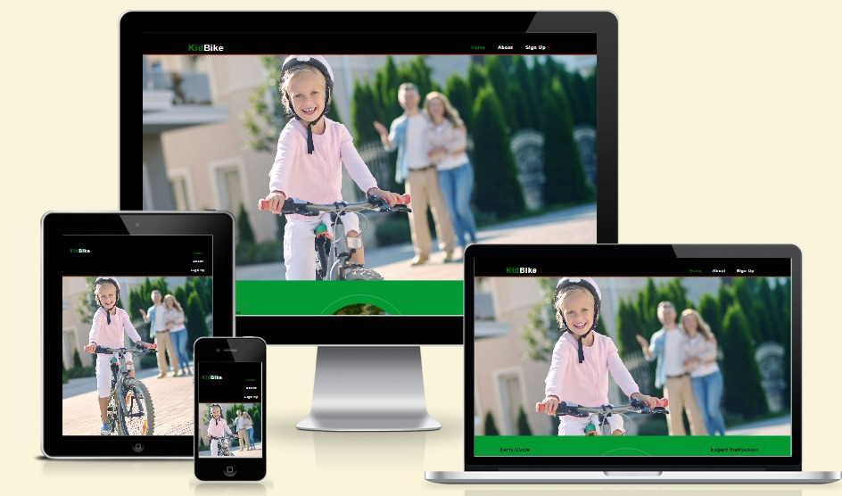
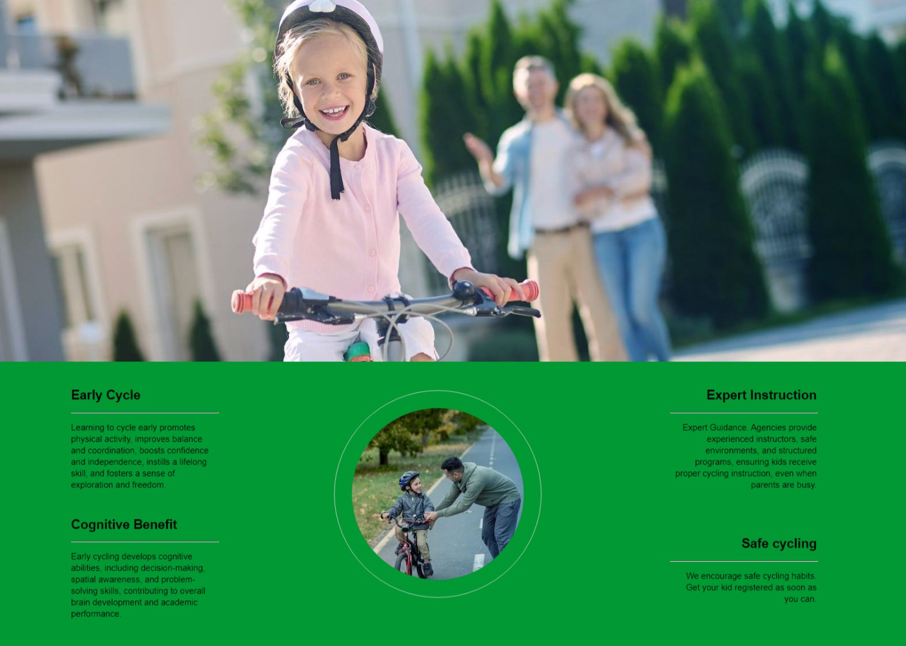
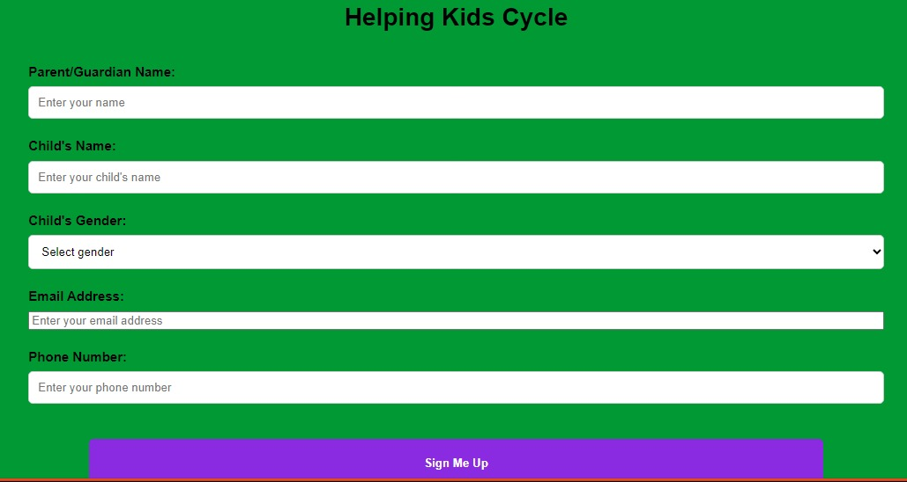

# KidBike: Fostering Early Cycling Adventures

#### Overview

Welcome to KidBike, where we envision a world where children embrace cycling's freedom and adventure. Our mission focuses on developing a lifelong love for cycling in the early years, fostering physical skills, independence, and exploration.

KidBike introduces kids to cycling's thrill early on, nurturing a passion for health and adventure. Our structured learning ensures a strong foundation, while our project caters to busy parents who seek comprehensive support.

KidBike is for parents who value active childhoods, offering accessible cycling education and exploration. We aid time-strapped parents in providing their children with essential cycling skills for a healthier future.

KidBike's mission extends beyond cycling; it cultivates independence and a zest for exploration. Our project equips parents with resources to initiate their children into cycling, promoting fitness and confidence from the start.

## Features 

In this section, you should go over the different parts of your project, and describe each in a sentence or so. You will need to explain what value each of the features provides for the user, focusing on who this website is for, what it is that they want to achieve and how your project is the best way to help them achieve these things.

### Existing Features

- __Navigation Bar__

  - Featured on all three pages, the full responsive navigation bar includes links to the Logo, Home page, Gallery and Sign Up page and is identical in each page to allow for easy navigation.
  - This section will allow the user to easily navigate from page to page across all devices without having to revert back to the previous page via the ‘back’ button. 

- __The landing page image__

  - The landing includes a photograph with text overlay to allow the user to see exactly which location this site would be applicable to. 
  - This section introduces the user to Love Running with an eye catching animation to grab their attention

- __Club Ethos Section__

  - The club ethos section will allow the user to see the benefits of joining the Love Running meetups, as well as the benefits of running overall. 
  - This user will see the value of signing up for the Love Running meetups. This should encourage the user to consider running as their form of exercise. 

- _

- __The Footer__ 

  - The footer section includes links to the relevant social media sites for Love Running. The links will open to a new tab to allow easy navigation for the user. 
  - The footer is valuable to the user as it encourages them to keep connected via social media

- __About__

  - The gallery will provide the user with supporting images to see what the meet ups look like. 
  - This section is valuable to the user as they will be able to easily identify the types of events the organisation puts together. 

- __The Sign Up Page__

  - This page will allow the user to get signed up to Love Running to start their running journey with the community. The user will be able specify if they would like to take part in road, trail or both types of running. The user will be asked to submit their full name and email address. 

For some/all of your features, you may choose to reference the specific project files that implement them.

In addition, you may also use this section to discuss plans for additional features to be implemented in the future:

## Testing 

In this section, you need to convince the assessor that you have conducted enough testing to legitimately believe that the site works well. Essentially, in this part you will want to go over all of your project’s features and ensure that they all work as intended, with the project providing an easy and straightforward way for the users to achieve their goals.

In addition, you should mention in this section how your project looks and works on different browsers and screen sizes.

You should also mention in this section any interesting bugs or problems you discovered during your testing, even if you haven't addressed them yet.

If this section grows too long, you may want to split it off into a separate file and link to it from here.

### Validator Testing 

- HTML
- 
- 
  - No errors were returned when passing through the official [W3C validator](validator.w3.org/nu/?dwere found when passing through the official [(W3C validator](https://validator.w3.org/nu/#textarea)

-CSS

![alt validate] (readmeimages/html validator.jpeg)- Pass
- No errors were returned when passing through the official [W3C validator](validator.w3.org/nu/?dwere found when passing through the official [(Jigsaw) validator](https://jigsaw.w3.org/css-validator/validator)

## Deployment

I deployed my websites which includes all pages. The site was deployed to GitHub pages. 

- The steps to deploy are as follows: 
  - In the GitHub repository, navigate to the Settings tab 
  - From the source section drop-down menu, select the Master Branch
  - Once the master branch has been selected, the page will be automatically refreshed with a detailed ribbon display to indicate the successful deployment. 

The live link can be found here - <https://samakinbile.github.io/KidBik/>

## Credits 

### Content 

- The text for the Home page was taken from internet and ChatGPT 
- Instructions on how to implement form validation on the Sign Up page was taken from [Specific YouTube Tutorial](https://www.openai.com/)
- The icons in the footer were taken from [Font Awesome](https://freepik.com/)
- The structure of the home page was taking from loverunnig walkthrough project (<https://learn.codeinstitute.net/courses/course-v1:CodeInstitute+LR101+2021_T1/courseware/4a07c57382724cfda5834497317f24d5/f2db5fd401004fccb43b01a6066a5333/>)

### Media

- The photos and image used on the home, about and sign up page are from freepik.com [image](https://www.freepik.com/) site.
