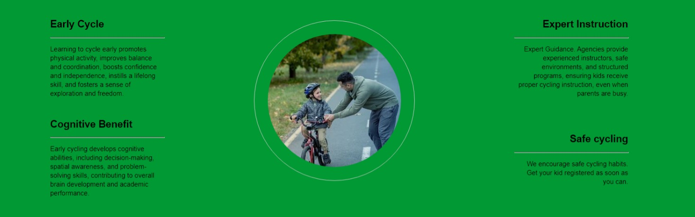
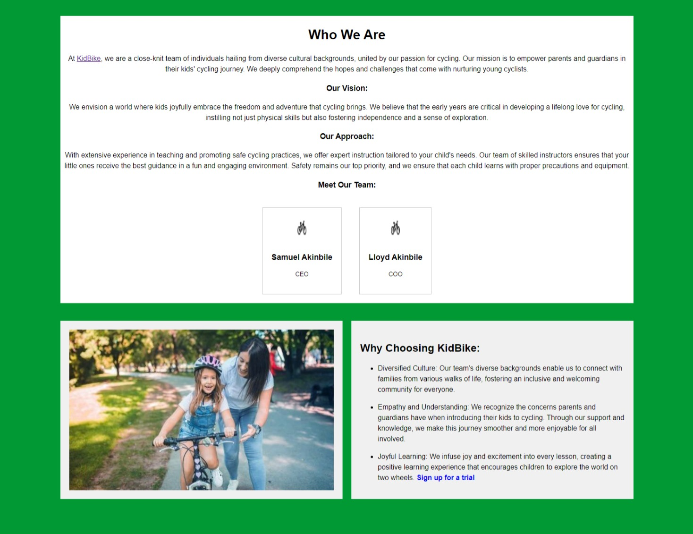
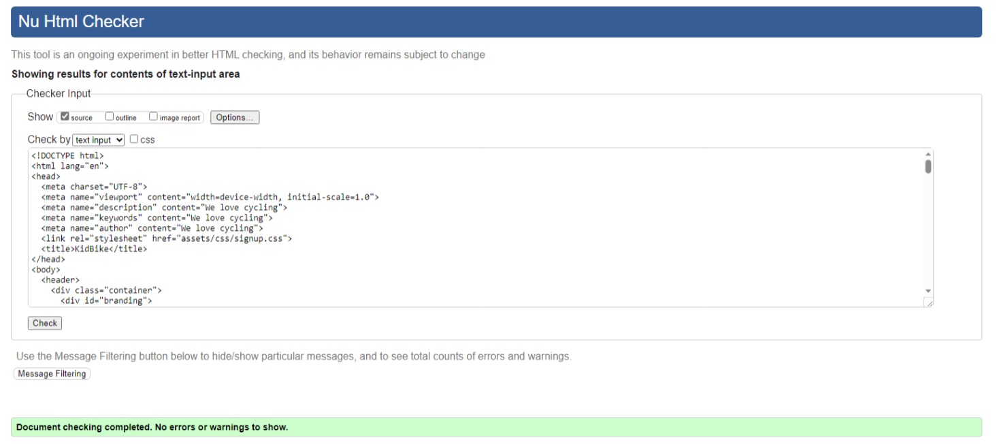
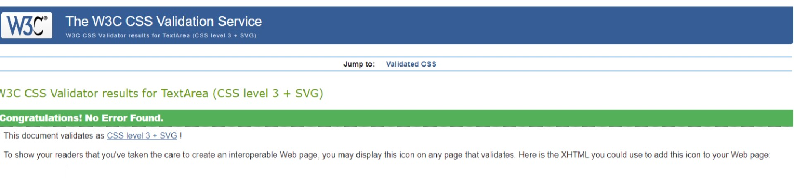

# KidBike: Fostering Early Cycling Adventures

## Unveiling Thrilling Beginnings:
Discover KidBike, igniting a lifelong love for cycling by introducing children to its exhilarating health and adventure. Our structured approach guarantees a solid foundation, nurturing both confidence and independence. Ideal for parents seeking a powerful start for their young cyclists.

### Target Audience:
KidBike is for parents who value active childhoods, offering accessible cycling education and exploration. We aid time-strapped parents in providing their children with essential cycling skills for a healthier future.

### Nurturing Independence and Curiosity:

KidBike isn't just about cycling; it's a journey of empowerment and discovery. Our comprehensive project arms parents with the tools they need to introduce their children to cycling, kickstarting a lifetime of fitness and self-assured exploration.

### Existing Features

- __Navigation Bar__

- Present on all three pages, the fully responsive navigation bar consists of links to the Logo, Home page, Gallery, and Sign Up page. It maintains uniformity across all pages for effortless navigation.
  - This feature enables seamless navigation across all devices, allowing users to move between pages without needing to use the 'back' button.

- __Club Ethos Section__

  - In the 'Club Ethos' section, parents and guardians can discover the advantages of early cycling for their children, promoting their cycling journey and highlighting the broader benefits of cycling as a whole.

  __The Footer__ 
  - The footer section contains links to KidBike's relevant social media platforms, designed to open in new tabs for convenient exploration by parents and guardians.

  - The footer holds significance for users by motivating them to stay connected through social media channels.

- __About__

  This webpage informs parents and guardians about our mission to support children. It presents insights into "who we are," "our vision," and "our approach." Addressing industry competition, we elucidate the reasons for selecting KidBike.

- __The Sign Up Page__

  - This signup page facilitates parental or guardian sign-up to KidBike, initiating their children's cycling journey within the community. Required details for sign-up include full name, email address, child's gender, and phone number.

## Technologies Used

__Github__ - Used for storage of my site and for publishing online.\
**Codeanywhere** - The IDE used for editing my site and pushing changes.\
**HTML5** - The core of the site was built with HTML version 5.\
**CSS** - CSS was used to style the website and define fonts and layout.\
**Font Awesome** - Social Media icons from Font Awesome.

### Validator Testing 

- HTML

 - No errors were returned when passing through the official [W3C validator](validator.w3.org/nu/?dwere found when passing through the official              [(W3C validator](https://validator.w3.org/nu/#textarea)

-CSS

 - Pass
 - Pass
 - pass

- No errors were returned when passing through the official [W3C validator](validator.w3.org/nu/?dwere found when passing through the official [(Jigsaw) validator](https://jigsaw.w3.org/css-validator/validator)

## Deployment

I deployed my websites which includes all pages. The site was deployed to GitHub pages. 

- The steps to deploy are as follows: 
  - In the GitHub repository, navigate to the Settings tab 
  - From the source section drop-down menu, select the Master Branch
  - Once the master branch has been selected, the page will be automatically refreshed with a detailed ribbon display to indicate the successful deployment. 

The live link can be found here - <https://samakinbile.github.io/KidBik/>

## Credits 

### Content 

- The text for the Home page was taken from internet and ChatGPT 
- Instructions on how to implement form validation on the Sign Up page was taken from [Specific YouTube Tutorial](https://www.openai.com/)
- The icons in the footer were taken from [Font Awesome](https://freepik.com/)
- The structure and content of the home page was taking from loverunnig walkthrough project (<https://learn.codeinstitute.net/courses/course-v1:CodeInstitute+LR101+2021_T1/courseware/4a07c57382724cfda5834497317f24d5/f2db5fd401004fccb43b01a6066a5333/>)

### Media

- The photos and image used on the home, about and sign up page are from freepik.com [image](https://www.freepik.com/) site